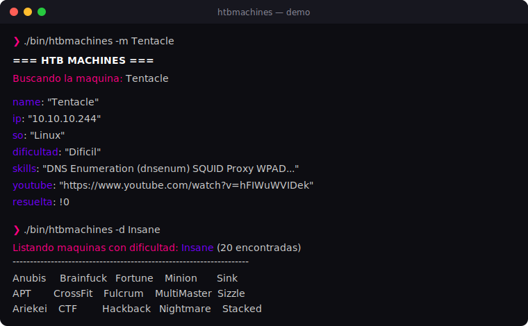

<div align="center">

# Htbmachines

Herramienta de línea de comandos escrita en **Bash** para consultar información sobre las máquinas de [Hack The Box](https://www.hackthebox.com/). Permite buscar máquinas por nombre, IP, dificultad, sistema operativo o skills, obtener su enlace de resolución en YouTube y mantener sincronizada la base de datos local.

<br>


<br>



</div>

Los datos se obtienen del fichero `bundle.js` publicado en [htbmachines.github.io](https://htbmachines.github.io/bundle.js), que contiene el catálogo de máquinas (nombre, IP, S.O., dificultad, skills, enlace de YouTube, etc.).

<div align="center">

## Características

</div>

- Búsqueda de una máquina por **nombre** con su ficha completa.
- Búsqueda de la máquina asociada a una **IP**.
- Obtención del **enlace de YouTube** con la resolución de una máquina.
- Filtrado de máquinas por **dificultad** (Fácil, Media, Difícil, Insane).
- Filtrado de máquinas por **sistema operativo** (Linux, Windows).
- Filtrado combinado por **S.O. + dificultad**.
- Filtrado de máquinas por **skill** / técnica.
- **Descarga y actualización** automática de la base de datos con verificación de integridad (SHA-256).
- Salida coloreada y salida limpia al pulsar `Ctrl+C`.

<div align="center">

## Paleta de colores

</div>

La interfaz usa una paleta neón definida en [`lib/colors.sh`](lib/colors.sh). Cada color se aplica mediante una función `print_*` que lo abre y lo cierra automáticamente.

|                                 Muestra                                  | Variable  | Código (RGB truecolor)         | Uso                                            |
| :----------------------------------------------------------------------: | --------- | ------------------------------ | ---------------------------------------------- |
|  | `_texto`  | `rgb(207, 207, 207)`           | Texto base / información neutra                |
|  | `_titulo` | `rgb(255, 255, 255)` (negrita) | Títulos y cabeceras                            |
|  | `_acento` | `rgb(112, 0, 255)`             | Violeta de acento: claves y valores destacados |
|  | `_brillo` | `rgb(255, 0, 128)`             | Rosa neón: acción principal en curso           |
|  | `_alerta` | `rgb(255, 0, 60)`              | Rojo carmesí: errores y avisos                 |

<div align="center">

## Requisitos

</div>

La herramienta depende de las siguientes utilidades, disponibles en la mayoría de distribuciones (o vía `apt install`):

| Dependencia                                       | Uso                                                                                                |
| ------------------------------------------------- | -------------------------------------------------------------------------------------------------- |
| `bash`                                            | Intérprete del script                                                                              |
| `curl`                                            | Descarga del `bundle.js`                                                                           |
| `js-beautify`                                     | Formatea el `bundle.js` para poder parsearlo (`apt install jsbeautifier` / `npm i -g js-beautify`) |
| `sponge`                                          | Escritura segura del fichero (paquete `moreutils`)                                                 |
| `awk`, `sed`, `grep`, `tr`, `column`, `sha256sum` | Procesado de texto (coreutils/gawk)                                                                |

<div align="center">

## Estructura del proyecto

</div>

```
proyecto-1/
├── bin/
│   └── htbmachines        # Entrypoint: parsea opciones y enruta a las funciones
├── lib/
│   ├── colors.sh          # Paleta de colores y funciones print_*
│   ├── menu.sh            # Parseo de argumentos (getopts)
│   ├── ui.sh              # Presentación, panel de ayuda y separadores
│   ├── utils.sh           # Lógica de búsqueda, filtrado y actualización
│   └── validators.sh      # Comprobaciones (existe máquina / IP / fichero)
├── data/
│   └── bundle.js          # Base de datos local (ignorada por git, se descarga con -u)
├── assets/
│   └── demo.svg           # Captura de la funcionalidad
└── README.md
```

> El directorio `data/` está en `.gitignore`: el `bundle.js` no se versiona y debe descargarse con la opción `-u` en el primer uso.

<div align="center">

## Instalación

</div>

```bash
git clone https://github.com/NiettoVale/linux-knowledge-base
cd linux-knowledge-base/scripts/proyecto-1
chmod +x bin/htbmachines

# (Opcional) accesible globalmente:
sudo ln -s "$PWD/bin/htbmachines" /usr/local/bin/htbmachines
```

<div align="center">

## Uso

</div>

```
[+] Uso:
    -u                  : Descargar o actualizar ficheros necesarios
    -i <dirección_ip>   : Buscar una máquina por su IP
    -y <nombre_maquina> : Busca el link de YouTube de una máquina
    -m <nombre_maquina> : Buscar una máquina por su nombre
    -d <dificultad>     : Filtra las máquinas por una dificultad
    -o <so>             : Filtra las máquinas por un sistema operativo
    -s <skill>          : Filtra las máquinas por una skill
    -h                  : Mostrar este panel de ayuda
```

### Ejemplos

```bash
# Descargar / actualizar la base de datos (necesario la primera vez)
./bin/htbmachines -u

# Ficha completa de una máquina
./bin/htbmachines -m Tentacle

# Máquina asociada a una IP
./bin/htbmachines -i 10.10.10.244

# Enlace de YouTube con la resolución
./bin/htbmachines -y Tentacle

# Listar máquinas por dificultad
./bin/htbmachines -d Difícil

# Listar máquinas por sistema operativo
./bin/htbmachines -o Linux

# Filtro combinado: S.O. + dificultad
./bin/htbmachines -o Linux -d Media

# Listar máquinas que entrenan una skill concreta
./bin/htbmachines -s "Active Directory"
```

<div align="center">

## Cómo funciona

</div>

1. **`bin/htbmachines`** carga las librerías, define las variables globales e instala el `trap` para `Ctrl+C`.
2. **`lib/menu.sh`** parsea las opciones con `getopts`. Cada flag incrementa un contador (`parameter_counter`) con un peso distinto, de forma que el entrypoint pueda decidir qué función invocar (incluida la combinación `-o` + `-d`, que suma `6 + 5 = 11`).
3. **`lib/utils.sh`** contiene la lógica: extrae la información del `bundle.js` combinando `awk`/`grep`/`sed`/`tr` sobre el bloque de cada máquina.
4. **`lib/validators.sh`** valida la existencia de la máquina, la IP o el propio fichero antes de operar.
5. En **`-u`**, si el `bundle.js` no existe se descarga; si ya existe, se descarga una copia temporal y se comparan los hashes SHA-256 para reemplazarlo solo cuando hay cambios.

<div align="center">

## Notas

</div>

- Las dificultades válidas son: **Fácil**, **Media**, **Difícil**, **Insane**.
- Los sistemas operativos válidos son: **Linux**, **Windows**.
- El filtrado por skills aplica tanto a máquinas Linux como Windows.
- Proyecto con fines educativos, desarrollado como práctica de scripting en Bash.

<div align="center">

## Créditos

</div>

Este proyecto está basado en la herramienta que **Marcelo Vázquez ([S4vitar](https://github.com/s4vitar))** desarrolla en su curso **Introducción a Linux**. La idea original y la lógica de consulta sobre el `bundle.js` son suyas.

La diferencia es la implementación: mientras que en el curso se resuelve en **un único fichero**, aquí decidí **modularizar** el proyecto (separando `colors`, `menu`, `ui`, `utils` y `validators` en `lib/`) y darle un enfoque propio, tanto en la organización del código como en la interfaz y la paleta de colores.

- Repositorio: [github.com/NiettoVale/linux-knowledge-base](https://github.com/NiettoVale/linux-knowledge-base)

<div align="center">

Distribuido bajo licencia **MIT**.

</div>
